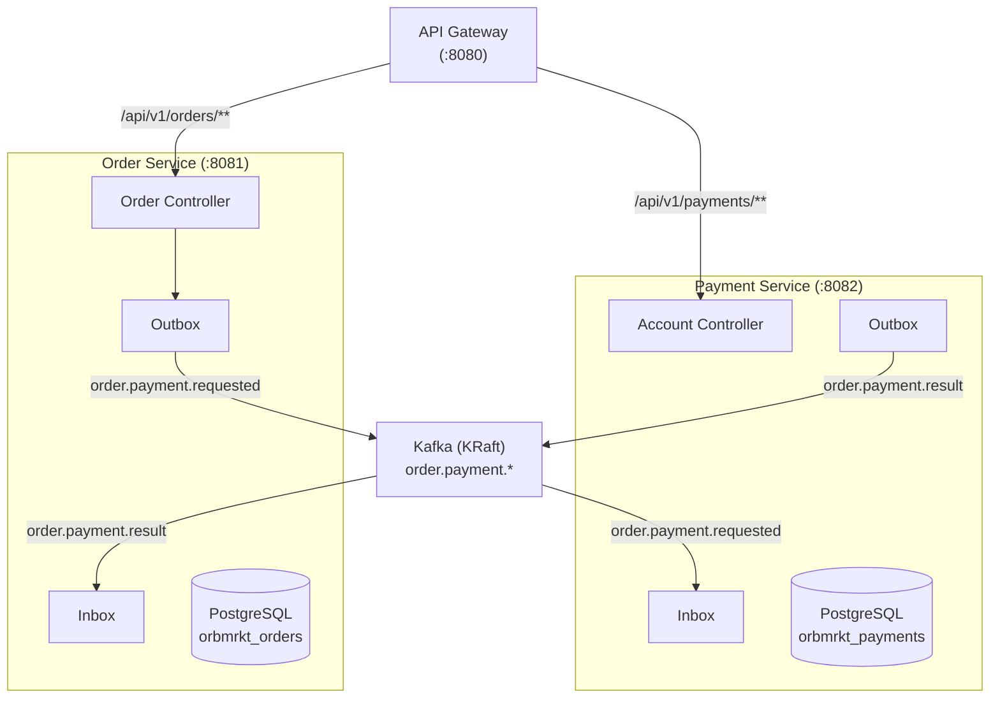

# orbmrkt


> Полное описание цели и roadmap — в [PROJECT.md](PROJECT.md).

## Описание

Микросервисная система управления заказами и платежами для продуктов спутниковых данных. Построена на event-driven архитектуре с Apache Kafka, использует паттерны Transactional Outbox и Inbox для надёжной доставки сообщений.

## Идентификация пользователя

- **Формат `user_id`**: UUID (например, `550e8400-e29b-41d4-a716-446655440000`)
- **Способ передачи**: заголовок `X-User-Id` (обязательный для всех запросов)
- **Для локальной разработки и демо**: `550e8400-e29b-41d4-a716-446655440000`

## Режимы операций

| Операция | Режим |
|----------|-------|
| Создание счёта, пополнение, просмотр баланса | Синхронно (HTTP) |
| Создание заказа | Синхронно (создаётся `CREATED`), затем асинхронно инициируется оплата |
| Списание геокредитов | Асинхронно (Kafka-событие) |
| Список заказов, детали заказа | Синхронно (HTTP) |

## Архитектура



**Event flow:**
1. Пользователь создаёт заказ → Order Service пишет `OrderPaymentRequested` в outbox
2. OutboxPollingWorker отправляет событие в топик `order.payment.requested`
3. Payment Service получает событие, проверяет inbox, списывает средства
4. Payment Service пишет `OrderPaymentCompleted`/`OrderPaymentFailed` в outbox
5. OutboxPollingWorker отправляет результат в топик `order.payment.result`
6. Order Service получает результат, обновляет статус заказа

## Архитектурные диаграммы

Подробные диаграммы доступны в [`docs/diagrams/`](docs/diagrams/):

- **[C4 Level 1: System Context](docs/diagrams/c1-context.puml)** – система в контексте внешнего мира (оператор ДЗЗ, аналитик, администратор)
- **[C4 Level 2: Container](docs/diagrams/c2-container.puml)** – технологические контейнеры (сервисы, БД, Kafka)
- **[Диаграммы потоков](docs/diagrams/flow-diagrams.md)** – Sequence, Activity, State диаграммы:
  - Happy Path (успешная оплата)
  - Payment Failed (недостаточно средств)
  - Outbox/Inbox Pattern (детально)
  - Order Lifecycle (жизненный цикл заказа)
  - Идемпотентность (повторный запрос)
  - Concurrent Operations (optimistic locking)

### Экспорт C4-диаграмм в PDF

```bash
# Скачать plantuml.jar (если ещё не скачан)
curl -L -o plantuml.jar https://github.com/plantuml/plantuml/releases/latest/download/plantuml.jar

# Скачать C4-PlantUML макросы (для локальной работы без интернета)
curl -L -o docs/diagrams/C4_Context.puml https://raw.githubusercontent.com/plantuml-stdlib/C4-PlantUML/master/C4_Context.puml
curl -L -o docs/diagrams/C4_Container.puml https://raw.githubusercontent.com/plantuml-stdlib/C4-PlantUML/master/C4_Container.puml

# Экспорт в PDF (с поддержкой кириллицы)
cd docs/diagrams
java -jar ../../plantuml.jar -charset UTF-8 -tpdf c1-context.puml
java -jar ../../plantuml.jar -charset UTF-8 -tpdf c2-container.puml
```

**Примечание:** PDF файлы генерируются локально и не коммитятся в репозиторий.

## Технологический стек

| Компонент | Технология |
|-----------|-----------|
| Язык | Java 21 |
| Фреймворк | Spring Boot 3.5.16 |
| Сборка | Gradle 9 (Kotlin DSL) |
| База данных | PostgreSQL 16 |
| Брокер сообщений | Apache Kafka (KRaft mode) |
| API Gateway | Spring Cloud Gateway (WebFlux) |
| Circuit Breaker | Resilience4j |
| Документация | Springdoc OpenAPI (springdoc-openapi-starter-webflux-ui) |
| Тестирование | JUnit 5, Testcontainers, Embedded Kafka |
| Контейнеризация | Docker, docker-compose |

## Структура проекта

```
orbmrkt/
├── api-gateway/                 # Маршрутизация, Circuit Breaker, обработка ошибок
│   ├── src/main/java/orbmrkt/gateway/
│   │   ├── ApiGatewayApplication.java
│   │   ├── controller/FallbackController.java
│   │   └── handler/GlobalErrorHandler.java
│   ├── build.gradle.kts
│   └── Dockerfile
├── common-dto/                  # Общие DTO + shared test utilities
│   ├── src/main/java/orbmrkt/dto/
│   │   ├── ApiResponse.java             # Generic обёртка ответа
│   │   ├── OrderStatus.java             # Статусы заказа (enum)
│   │   ├── ProductType.java             # Типы продуктов (enum)
│   │   ├── OrderPaymentRequested.java   # Событие: запрос оплаты
│   │   ├── OrderPaymentCompleted.java   # Событие: оплата успешна
│   │   └── OrderPaymentFailed.java      # Событие: оплата не удалась
│   ├── src/testFixtures/java/orbmrkt/test/
│   │   └── KafkaTestUtils.java         # Shared Kafka helper for all services
│   └── build.gradle.kts
├── order-service/               # REST API заказов + Kafka producer/consumer
│   ├── src/main/java/orbmrkt/
│   │   ├── OrderApplication.java
│   │   ├── order/
│   │   │   ├── controller/OrderController.java
│   │   │   ├── service/OrderService.java
│   │   │   ├── dto/ (CreateOrderRequest, OrderResponse, ArchivePayload)
│   │   │   ├── model/ (OrderEntity, OutboxEntity, InboxEntity)
│   │   │   ├── repository/ (OrderRepository, OutboxRepository, InboxRepository)
│   │   │   ├── messaging/ (OrderEventPublisher, OrderEventConsumer, OutboxPollingWorker)
│   │   │   ├── config/OutboxProperties.java
│   │   │   └── exception/ (OrderException, GlobalExceptionHandler)
│   │   └── ...
│   ├── src/test/java/orbmrkt/order/
│   │   ├── OrdersIntegrationTest.java
│   │   └── service/
│   │       └── OrderServiceTest.java
│   ├── build.gradle.kts
│   └── Dockerfile
├── payment-service/             # REST API платежей + Kafka producer/consumer
│   ├── src/main/java/orbmrkt/
│   │   ├── PaymentApplication.java
│   │   ├── payment/
│   │   │   ├── controller/AccountController.java
│   │   │   ├── service/AccountService.java
│   │   │   ├── dto/ (TopUpRequest, BalanceResponse, AccountResponse)
│   │   │   ├── model/ (AccountEntity, OutboxEntity, InboxEntity, ProcessedPaymentEntity)
│   │   │   ├── repository/ (AccountRepository, OutboxRepository, InboxRepository, ProcessedPaymentRepository)
│   │   │   ├── messaging/ (PaymentEventPublisher, PaymentEventConsumer, OutboxPollingWorker)
│   │   │   ├── config/OutboxProperties.java
│   │   │   └── exception/ (PaymentException, GlobalExceptionHandler)
│   │   └── ...
│   ├── src/test/java/orbmrkt/payment/
│   │   ├── PaymentsIntegrationTest.java
│   │   └── service/
│   │       └── AccountServiceTest.java
│   ├── build.gradle.kts
│   └── Dockerfile
├── docs/
│   └── analytics.sql             # Пример аналитического запроса
├── docker-compose.yml
├── .env.example
├── settings.gradle.kts
└── build.gradle.kts
```

## Быстрый старт

### Требования
- JDK 21
- Docker и docker-compose

### Запуск через Docker

```bash
# Копировать и настроить окружение
cp .env.example .env

# Запустить все сервисы
docker compose up -d
```

После запуска будут доступны:
- **API Gateway:** `http://localhost:8080`
- **Kafka UI:** `http://localhost:8085`
- - **Swagger UI** – `http://localhost:8080/swagger-ui.html` (агрегированные API всех сервисов)

### Локальная разработка

```bash
# Запустить инфраструктуру (Kafka + БД)
docker compose up -d kafka kafka-ui order-service-db payment-service-db

# Запустить сервисы по отдельности
./gradlew :order-service:bootRun
./gradlew :payment-service:bootRun
./gradlew :api-gateway:bootRun
```

### Сборка

```bash
./gradlew build -x test
```

## Конфигурация

Все настройки задаются через переменные окружения (файл `.env`):

| Переменная | Значение по умолчанию | Описание |
|-----------|----------------------|----------|
| `ORDER_SERVICE_DB_NAME` | `orbmrkt_orders` | Имя БД сервиса заказов |
| `ORDER_SERVICE_DB_USER` | `postgres` | Пользователь БД |
| `ORDER_SERVICE_DB_PASSWORD` | – | Пароль БД |
| `PAYMENT_SERVICE_DB_NAME` | `orbmrkt_payments` | Имя БД платёжного сервиса |
| `PAYMENT_SERVICE_DB_USER` | `postgres` | Пользователь БД |
| `PAYMENT_SERVICE_DB_PASSWORD` | – | Пароль БД |
| `ORDER_SERVICE_PORT` | `8081` | Порт сервиса заказов |
| `PAYMENT_SERVICE_PORT` | `8082` | Порт платёжного сервиса |
| `GATEWAY_PORT` | `8080` | Порт API Gateway |

## API endpoints

### Order Service (`:8081`)

| Метод | Путь | Описание |
|-------|------|----------|
| `POST` | `/api/v1/orders` | Создать заказ |
| `GET` | `/api/v1/orders` | Список заказов пользователя |
| `GET` | `/api/v1/orders/{orderId}` | Детали заказа |

**Заголовки:** `X-User-Id: 550e8400-e29b-41d4-a716-446655440000` (обязательный)

**Создание заказа:**
```json
{
  "product_type": "ARCHIVE",
  "price": 120,
  "payload": {
    "aoi": "POLYGON((...))",
    "capture_date": "2026-06-01",
    "sensor_type": "OPTICAL"
  }
}
```

### Payment Service (`:8082`)

| Метод | Путь | Описание |
|-------|------|----------|
| `POST` | `/api/v1/payments/accounts` | Создать счёт (идемпотентно: 200 ОК, конкурентный race → 409) |
| `POST` | `/api/v1/payments/accounts/top-up` | Пополнить баланс |
| `GET` | `/api/v1/payments/accounts/balance` | Получить текущий баланс |

**Заголовки:** `X-User-Id: 550e8400-e29b-41d4-a716-446655440000` (обязательный)

**Пополнение баланса:**
```json
{
  "amount": 1000
}
```

**Формат ответа (успех):**
```json
{
  "user_id": "user-42",
  "balance": 880,
  "currency": "geocredits"
}
```

**Формат ответа (ошибка):**
```json
{
  "error_code": "INSUFFICIENT_BALANCE",
  "message": "Insufficient balance",
  "timestamp": "2026-07-11T12:00:00Z"
}
```

### API Gateway (`:8080`)

Единая точка входа. Маршрутизирует запросы к сервисам по префиксу пути:
- `/api/v1/orders/**` → Order Service
- `/api/v1/payments/**` → Payment Service

Circuit Breaker для каждого сервиса: `slidingWindowSize=10`, `failureRateThreshold=50%`, `timeoutDuration=10s`. При недоступности сервиса возвращается `503`.

Документация Swagger UI доступна в профиле по умолчанию: `http://localhost:8080/webjars/swagger-ui/index.html`

## Kafka-события

| Топик | Продюсер | Консьюмер | Описание |
|-------|----------|-----------|----------|
| `order.payment.requested` | Order Service | Payment Service | Запрос на оплату заказа |
| `order.payment.result` | Payment Service | Order Service | Результат оплаты |

### OrderPaymentRequested
```json
{
  "event_id": "uuid",
  "order_id": "uuid",
  "user_id": "string",
  "amount": 120,
  "occurred_at": "2026-07-04T12:00:00Z"
}
```

### OrderPaymentCompleted
```json
{
  "event_id": "uuid",
  "order_id": "uuid",
  "user_id": "string",
  "amount": 120,
  "new_balance": 880
}
```

### OrderPaymentFailed
```json
{
  "event_id": "uuid",
  "order_id": "uuid",
  "user_id": "string",
  "reason": "INSUFFICIENT_BALANCE"
}
```

## Надёжная доставка сообщений

### Transactional Outbox
- Событие записывается в таблицу `outbox` в той же БД-транзакции, что и бизнес-операция
- `OutboxPollingWorker` (с периодичностью 500 мс) выбирает неотправленные события и публикует в Kafka
- Экспоненциальная задержка при ошибке: 2 с → 4 с → 8 с → 16 с → 32 с
- После `max-attempts` (5) событие помечается как dead letter

### Transactional Inbox
- Перед обработкой события проверяется таблица `inbox` на наличие `event_id`
- При дубликате событие пропускается
- Обеспечивает exactly-once processing на стороне консьюмера

### Очистка
- Ежедневно в 03:00 удаляются обработанные записи outbox старше 7 дней

## Тестирование

```bash
# Все тесты
./gradlew test

# Payment Service (11 integration + 1 unit)
./gradlew :payment-service:test

# Order Service (16 integration + 3 unit)
./gradlew :order-service:test
```

- **Testcontainers** – PostgreSQL в Docker-контейнере
- **Embedded Kafka** – встроенный Kafka-брокер для тестов
- **JUnit 5** + Spring Boot Test
- **`application-test.yml`** в каждом сервисе: `spring.mvc.throw-exception-if-no-handler-found=true`

### Test counts by module

**order-service** (16 integration + 3 unit):
- `OrdersIntegrationTest` – 16 integration tests: CRUD, validation (missing headers, invalid JSON, zero/negative price, invalid/missing payload, unknown product type), product types (tasking, monitoring), wrong user, 404
- `OrderServiceTest` – 3 unit tests (edge cases: zeroPrice, serializePayloadFails, savesRejectedOrder)

**payment-service** (11 integration + 1 unit):
- `PaymentsIntegrationTest` – 11 integration tests: create account (duplicate/409), top-up (valid, invalid amount, negative, invalid JSON), get balance (success, account not found), 404
- `AccountServiceTest` – 1 unit test (debit_sufficientFunds)

### Shared test utilities
- `KafkaTestUtils` вынесен в `common-dto/src/testFixtures/java/orbmrkt/test/`
- Подключается через `testImplementation(testFixtures(project(":common-dto")))`

### Testing conventions
- Exception handlers (400/404/409) – integration tests only (MockMvc end-to-end)
- Global catch-all (`handleGeneral`) – intentionally not tested
- Scheduled workers (`OutboxPollingWorker`) – excluded from JaCoCo

### Code Coverage (JaCoCo)

```bash
# Тесты + отчёты + проверка порогов
./gradlew check

# Агрегированный отчёт по всем модулям
./gradlew jacocoRootReport
```

- **Агрегированный отчёт:** `build/reports/jacoco/jacocoRootReport/html/index.html`
- **Отчёт по модулю:** `{module}/build/reports/jacoco/test/html/index.html`
- **Пороги покрытия:** LINE ≥ 60%, BRANCH ≥ 50%
- **Исключён из проверки:** модуль `:common-dto`
- **Исключённые паттерны классов:**
  - `**/dto/**`, `**/*Application.class`, `**/*Exception.class`
  - `**/config/*Properties.class`, `**/model/**`
  - `**/payment/messaging/**`, `**/order/messaging/**` (scheduled workers)

## Соглашения проекта

- REST prefix: `/api/v1/...`
- `X-User-Id` – обязательный заголовок для всех запросов, формат UUID (например, `550e8400-e29b-41d4-a716-446655440000`)
- Формат ответа: успех – flat JSON (DTO напрямую), ошибка – `ApiResponse` с `error_code`, `message`, `timestamp`
- Поля: camelCase в Java, snake_case в JSON
- Kafka event_id – UUID для дедупликации
- Конфигурация через переменные окружения
- Код на Java 21

## План развития до MVP

### 1. Надёжность и наблюдаемость
- **Структурированное логирование (JSON)** – `logstash-logback-encoder`, MDC (`userId`, `requestId`, `traceId`)
- **Distributed tracing** – Micrometer Tracing + Brave/Zipkin
- **Метрики** – Micrometer + Prometheus

### 2. Безопасность
- **Аутентификация** – JWT/OAuth2
- **Rate limiting** – на API Gateway

### 3. Фронтенд
- **TypeSpec → OpenAPI → React + Vite**
- `api-spec/` – TypeSpec-спецификации
- `frontend/` – React 19 + TypeScript 5 + Vite
- Компоненты: UserSelector, AccountPanel, OrderPanel

### 4. CI/CD
- GitHub Actions – test, build, docker push
- **SCA (Software Composition Analysis)** – проверка зависимостей на известные CVE (OWASP Dependency-Check или Snyk)
- **Security scanning в CI/CD** – автоматический запуск Gitleaks + Semgrep + SCA при каждом push
