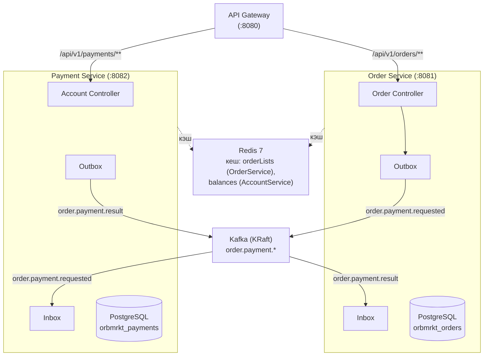

# orbmrkt


> Полное описание цели и roadmap - в [PROJECT.md](PROJECT.md).

## Описание

Микросервисная система управления заказами и платежами для продуктов спутниковых данных. Построена на event-driven архитектуре с Apache Kafka, использует паттерны Transactional Outbox и Inbox для надёжной доставки сообщений.

## Идентификация пользователя

- **Формат `user_id`**: UUID (например, `550e8400-e29b-41d4-a716-446655440000`)
- **Способ передачи**: заголовок `X-User-Id` (обязательный для всех запросов)
- **Для локальной разработки и демо**: `550e8400-e29b-41d4-a716-446655440000`

## Режимы операций

| Операция | Режим |
|----------|-------|
| Создание счёта, пополнение, просмотр баланса | Синхронно (HTTP) |
| Создание заказа | Синхронно (создаётся `CREATED`), затем асинхронно инициируется оплата |
| Списание геокредитов | Асинхронно (Kafka-событие) |
| Список заказов, детали заказа | Синхронно (HTTP) |

## Архитектура



**Event flow:**
1. Пользователь создаёт заказ → Order Service пишет `OrderPaymentRequested` в outbox
2. OutboxPollingWorker отправляет событие в топик `order.payment.requested`
3. Payment Service получает событие, проверяет inbox, списывает средства
4. Payment Service пишет `OrderPaymentCompleted`/`OrderPaymentFailed` в outbox
5. OutboxPollingWorker отправляет результат в топик `order.payment.result`
6. Order Service получает результат, обновляет статус заказа

## Архитектурные диаграммы

Подробные диаграммы доступны в [`docs/diagrams/`](docs/diagrams/):

- **C1 System Context** — [`docs/diagrams/c1-context.puml`](docs/diagrams/c1-context.puml) / [PDF](docs/diagrams/c1-context.pdf) — система в контексте внешнего мира (оператор ДЗЗ, аналитик, администратор)
- **C2 Containers** — [`docs/diagrams/c2-container.puml`](docs/diagrams/c2-container.puml) / [PDF](docs/diagrams/c2-container.pdf) — технологические контейнеры (сервисы, БД, Kafka)
- **[Диаграммы потоков](docs/diagrams/flow-diagrams.md)** – Sequence, State диаграммы:
  - Happy Path (успешная оплата)
  - Payment Failed (недостаточно средств)
  - Order Lifecycle (жизненный цикл заказа)
  - Идемпотентность (повторный запрос)
  - Concurrent Operations (optimistic locking)


## Технологический стек

| Компонент | Технология |
|-----------|-----------|
| Язык | Java 21 |
| Фреймворк | Spring Boot 3.5.16 |
| Сборка | Gradle 9 (Kotlin DSL) |
| Checkstyle | 10.23.0 (Google Java Style, maxLineLength=120) |
| SAST | Trivy (via Syft SBOM) |
| База данных | PostgreSQL 16 |
| Брокер сообщений | Apache Kafka (KRaft mode) |
| Кеширование | Redis 7 (TTL 10с, JSON-сериализация) |
| API Gateway | Spring Cloud Gateway (WebFlux) |
| Circuit Breaker | Resilience4j |
| Документация | Springdoc OpenAPI (springdoc-openapi-starter-webflux-ui) |
| Тестирование | JUnit 5, Testcontainers, Embedded Kafka |
| Контейнеризация | Docker, docker-compose |

## Быстрый старт

### Требования
- JDK 21
- Docker и docker-compose

### Запуск через Docker

```bash
# Копировать и настроить окружение
cp .env.example .env

# Запустить все сервисы
docker compose up -d
```

После запуска будут доступны:
- **API Gateway:** `http://localhost:8080`
- **Kafka UI:** `http://localhost:8085`
- **Swagger UI** – `http://localhost:8080/swagger-ui.html` (агрегированные API всех сервисов)

### Локальная разработка

```bash
# Запустить инфраструктуру (Kafka + БД)
docker compose up -d kafka kafka-ui order-service-db payment-service-db

# Запустить сервисы по отдельности
./gradlew :order-service:bootRun
./gradlew :payment-service:bootRun
./gradlew :api-gateway:bootRun
```

### Сборка

```bash
# Полная сборка (Checkstyle + тесты + JaCoCo)
./gradlew build

# Без тестов
./gradlew build -x test
```

## Конфигурация

Все настройки задаются через переменные окружения (файл `.env`):

| Переменная | Значение по умолчанию | Описание |
|-----------|----------------------|----------|
| `ORDER_SERVICE_DB_NAME` | `orbmrkt_orders` | Имя БД сервиса заказов |
| `ORDER_SERVICE_DB_USER` | `postgres` | Пользователь БД |
| `ORDER_SERVICE_DB_PASSWORD` | – | Пароль БД |
| `PAYMENT_SERVICE_DB_NAME` | `orbmrkt_payments` | Имя БД платёжного сервиса |
| `PAYMENT_SERVICE_DB_USER` | `postgres` | Пользователь БД |
| `PAYMENT_SERVICE_DB_PASSWORD` | – | Пароль БД |
| `ORDER_SERVICE_PORT` | `8081` | Порт сервиса заказов |
| `PAYMENT_SERVICE_PORT` | `8082` | Порт платёжного сервиса |
| `GATEWAY_PORT` | `8080` | Порт API Gateway |

## REST API

### Order Service (сервис заказов)

Префикс: `/api/v1/orders`

| Метод | Путь | Описание |
|-------|------|----------|
| `POST` | `/orders` | Создать заказ (триггер асинхронной оплаты) |
| `GET` | `/orders` | Список заказов текущего user_id |
| `GET` | `/orders/{order_id}` | Детали и статус |

**Заголовки:** `X-User-Id: 550e8400-e29b-41d4-a716-446655440000` (обязательный)


### Payment Service (платёжный сервис)

Префикс: `/api/v1/payments`

| Метод | Путь | Описание |
|-------|------|----------|
| `POST` | `/accounts` | Создать счёт для user_id из заголовка |
| `POST` | `/accounts/top-up` | Пополнение |
| `GET` | `/accounts/balance` | Баланс текущего пользователя |

**Заголовки:** `X-User-Id: 550e8400-e29b-41d4-a716-446655440000` (обязательный)


### API Gateway (`:8080`)

Единая точка входа. Маршрутизирует запросы к сервисам по префиксу пути:
- `/api/v1/orders/**` → Order Service
- `/api/v1/payments/**` → Payment Service

Circuit Breaker для каждого сервиса: `slidingWindowSize=10`, `failureRateThreshold=50%`, `timeoutDuration=10s`. При недоступности сервиса возвращается `503`.

Документация Swagger UI: `http://localhost:8080/swagger-ui.html`

## Kafka-события

| Топик | Продюсер | Консьюмер | Описание |
|-------|----------|-----------|----------|
| `order.payment.requested` | Order Service | Payment Service | Запрос на оплату заказа |
| `order.payment.result` | Payment Service | Order Service | Результат оплаты |


## Надёжная доставка сообщений

### Transactional Outbox
- Событие записывается в таблицу `outbox` в той же БД-транзакции, что и бизнес-операция
- `OutboxPollingWorker` (с периодичностью 500 мс) выбирает неотправленные события и публикует в Kafka
- Экспоненциальная задержка при ошибке: 2 с → 4 с → 8 с → 16 с → 32 с
- После `max-attempts` (5) событие помечается как dead letter

### Transactional Inbox
- Перед обработкой события проверяется таблица `inbox` на наличие `event_id`
- При дубликате событие пропускается
- Обеспечивает exactly-once processing на стороне консьюмера

### Очистка
- Ежедневно в 03:00 удаляются обработанные записи outbox старше 7 дней

## Тестирование

```bash
# Все тесты
./gradlew test

# Отдельный сервис
./gradlew :payment-service:test
./gradlew :order-service:test
```

- **Testcontainers** – PostgreSQL в Docker-контейнере
- **Embedded Kafka** – встроенный Kafka-брокер для тестов
- **JUnit 5** + Spring Boot Test
- **`application-test.yml`** в каждом сервисе: `spring.mvc.throw-exception-if-no-handler-found=true`

### End-to-End (E2E) tests

Отдельный репозиторий с автотестами (REST API + Kafka-события, Testcontainers):
[github.com/RasmuS2024/orbmrkt-autotests](https://github.com/RasmuS2024/orbmrkt-autotests)

**Account API (3 теста):** create account, top-up, balance — все happy-path.
**Order API (3 теста):** create order, list orders, get order — все happy-path.
**Cross-service (6 тестов):** полные сценарии через Gateway (happy path, insufficient funds, idempotent order, two orders, duplicate account, concurrent operations).

Happy-path тесты вынесены в E2E и удалены из модульных тестов (избежание дублирования).

### Общие утилиты тестирования
- `KafkaTestUtils` вынесен в `common-dto/src/testFixtures/java/orbmrkt/test/`
- Подключается через `testImplementation(testFixtures(project(":common-dto")))`

### Соглашения по тестированию
- Exception handlers (400/404/409) – integration tests only (MockMvc end-to-end)
- Global catch-all (`handleGeneral`) – intentionally not tested
- Scheduled workers (`OutboxPollingWorker`) – excluded from JaCoCo

### Покрытие кода (JaCoCo)

```bash
# Тесты + отчёты + проверка порогов
./gradlew check

# Агрегированный отчёт по всем модулям
./gradlew jacocoRootReport
```

- **Агрегированный отчёт:** `build/reports/jacoco/jacocoRootReport/html/index.html`
- **Отчёт по модулю:** `{module}/build/reports/jacoco/test/html/index.html`
- **Пороги покрытия:** LINE ≥ 60%, BRANCH ≥ 50%
- **Исключён из проверки:** модуль `:common-dto`
- **Исключённые паттерны классов:**
  - `**/dto/**`, `**/*Application.class`, `**/*Exception.class`
  - `**/config/*Properties.class`, `**/model/**`
  - `**/payment/messaging/**`, `**/order/messaging/**` (scheduled workers)

## Соглашения проекта

- REST prefix: `/api/v1/...`
- `X-User-Id` – обязательный заголовок для всех запросов, формат UUID (например, `550e8400-e29b-41d4-a716-446655440000`)
- Формат ответа: успех – flat JSON (DTO напрямую), ошибка – `ApiResponse` с `error_code`, `message`, `timestamp`
- Поля: camelCase в Java, snake_case в JSON
- Kafka event_id – UUID для дедупликации
- Конфигурация через переменные окружения
- Код на Java 21

## Что дальше

### 1. Надёжность и наблюдаемость
- **Структурированное логирование (JSON)** – `logstash-logback-encoder`, MDC (`userId`, `requestId`, `traceId`)
- **Distributed tracing** – Micrometer Tracing + Brave/Zipkin
- **Метрики** – Micrometer + Prometheus

### 2. Безопасность
- **Аутентификация** – JWT/OAuth2
- **Rate limiting** – на API Gateway

### 3. Фронтенд
- **TypeSpec → OpenAPI → React + Vite**
- `frontend/` – React 19 + TypeScript 5 + Vite
- Компоненты: UserSelector, AccountPanel, OrderPanel
