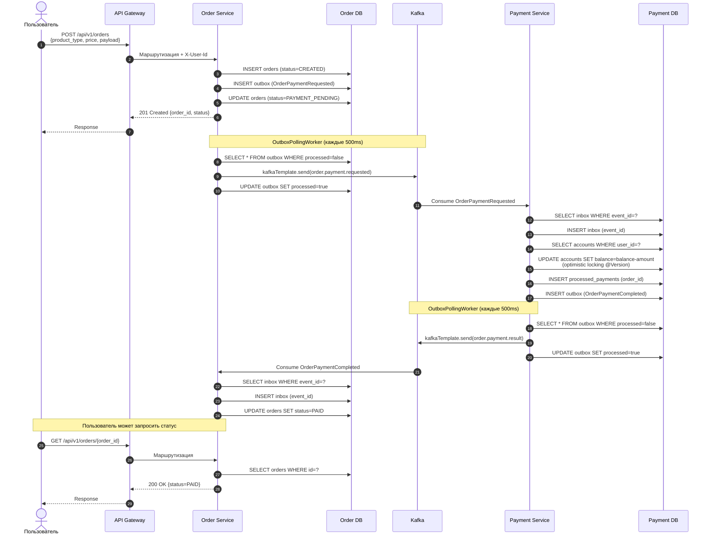
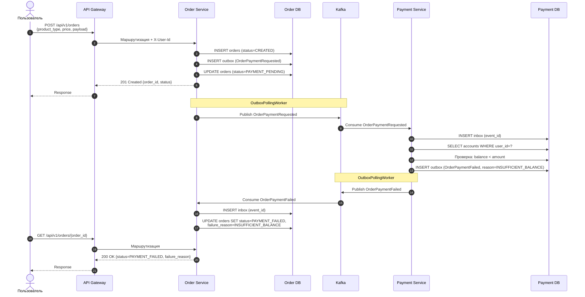
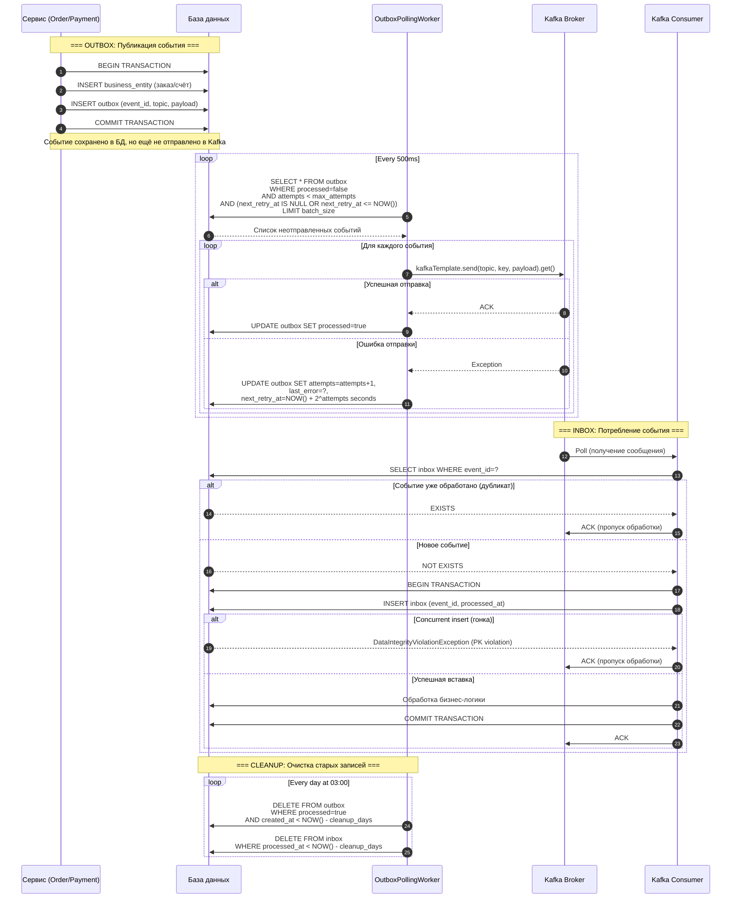
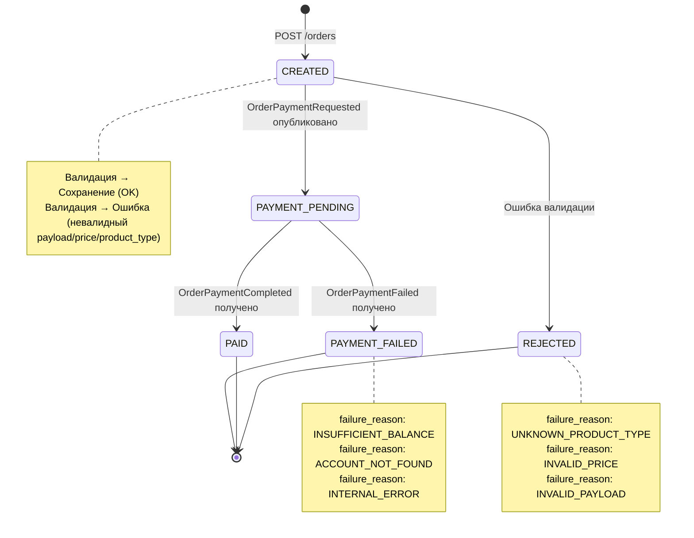
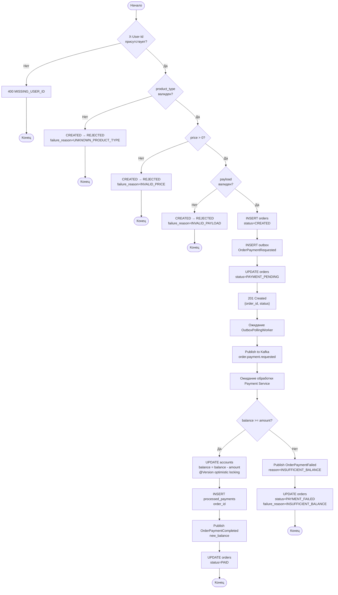
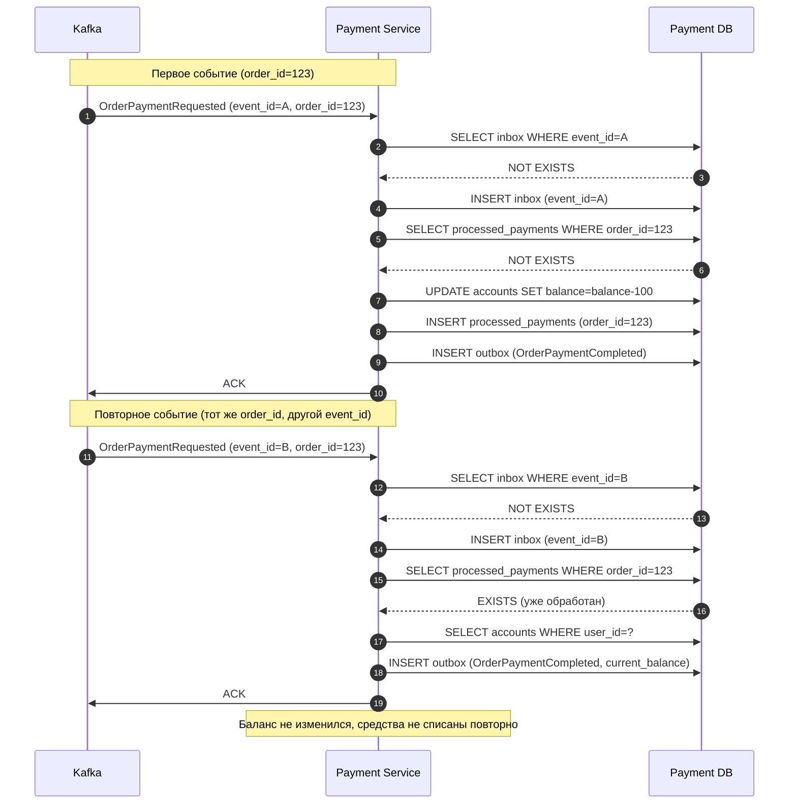
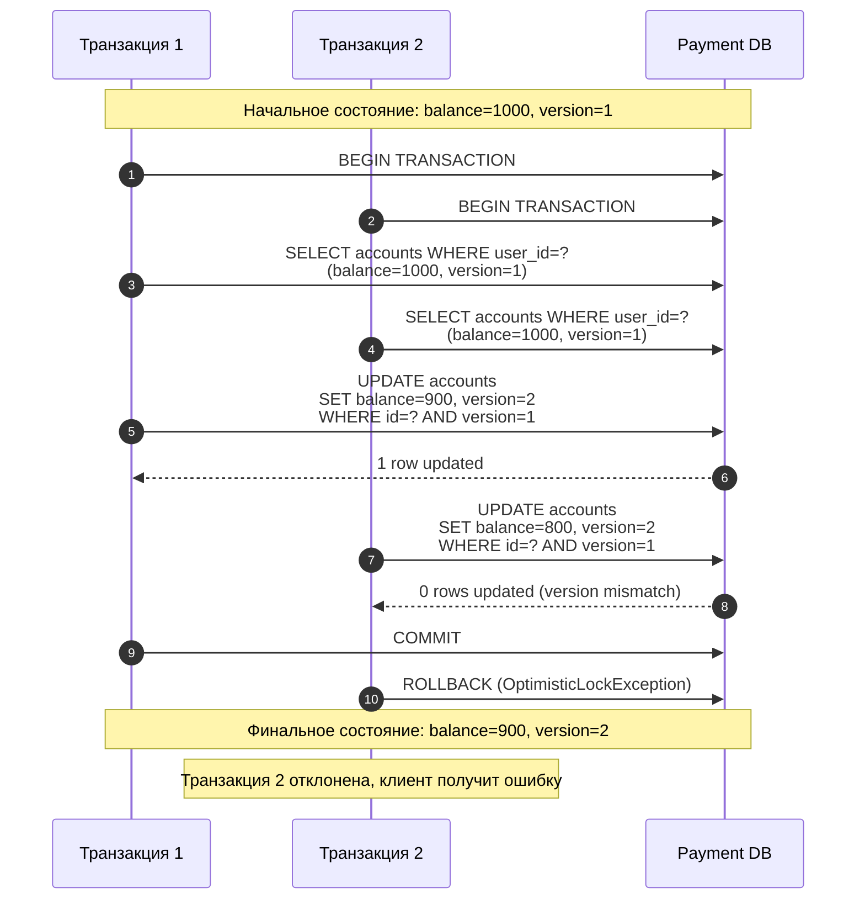

# Диаграммы потоков (Flow Diagrams)

## Описание

Диаграммы потоков показывают взаимодействие между компонентами системы во времени (Sequence Diagrams) и жизненный цикл сущностей (State Diagrams).

---

## 1. Sequence Diagram: Happy Path (успешная оплата)

### Описание
Пользователь создаёт заказ, система успешно списывает средства и обновляет статус заказа на PAID.

### Диаграмма

### Ключевые моменты
- **Шаги 1-6:** Синхронное создание заказа (одна транзакция)
- **Шаги 7-9:** Асинхронная публикация события через Outbox
- **Шаги 10-16:** Обработка оплаты в Payment Service (одна транзакция)
- **Шаги 17-19:** Асинхронная публикация результата через Outbox
- **Шаги 20-23:** Обновление статуса заказа в Order Service

---

## 2. Sequence Diagram: Payment Failed (недостаточно средств)

### Описание
Пользователь создаёт заказ, но на счету недостаточно средств. Система отклоняет оплату и устанавливает статус PAYMENT_FAILED.

### Диаграмма

### Ключевые моменты
- **Шаг 11:** Проверка баланса выявляет недостаточно средств
- **Шаг 12:** Публикация события `OrderPaymentFailed` с причиной
- **Шаг 17:** Статус заказа обновляется на `PAYMENT_FAILED`
- Баланс остаётся неизменным, средства не списываются

---

## 3. Sequence Diagram: Outbox/Inbox Pattern (детально)

### Описание
Детальное взаимодействие компонентов Transactional Outbox и Inbox для обеспечения надёжной доставки событий.

### Диаграмма

### Ключевые моменты

**Outbox:**
- **Шаги 1-4:** Атомарное сохранение бизнес-сущности и события в одной транзакции
- **Шаги 6-20:** Polling worker асинхронно публикует события в Kafka
- **Экспоненциальная задержка:** 2s → 4s → 8s → 16s → 32s при ошибках
- **Dead letter:** После `max_attempts` событие остаётся в БД с `processed=false`

**Inbox:**
- **Шаги 22-38:** Consumer проверяет дубликаты перед обработкой
- **Двойная защита:** `existsByEventId()` + catch `DataIntegrityViolationException`
- **Idempotency:** Дубликаты пропускаются без retry

**Cleanup:**
- **Шаги 40-43:** Ежедневная очистка старых записей (по умолчанию 7 дней)

---

## 4. State Diagram: Order Lifecycle

### Описание
Жизненный цикл заказа от создания до финального статуса.

### Диаграмма

### Статусы

| Статус | Описание | Переход |
|--------|----------|---------|
| **CREATED** | Заказ создан, событие на оплату ещё не отправлено | Начальный статус после POST /orders |
| **PAYMENT_PENDING** | Команда на списание отправлена в Kafka | После публикации OrderPaymentRequested |
| **PAID** | Списание успешно | После получения OrderPaymentCompleted |
| **PAYMENT_FAILED** | Оплата не прошла | После получения OrderPaymentFailed |
| **REJECTED** | Заказ отклонён при создании | При ошибке валидации (невалидный payload, price ≤ 0, неизвестный product_type) |

### Причины отказа (failure_reason)

| Код | Описание | Когда возникает |
|-----|----------|-----------------|
| **UNKNOWN_PRODUCT_TYPE** | Неподдерживаемый тип продукта | product_type не ARCHIVE/TASKING/MONITORING |
| **INVALID_PRICE** | Некорректная цена | price ≤ 0 или null |
| **INVALID_PAYLOAD** | Невалидный payload | Отсутствуют обязательные поля (aoi, capture_date, sensor_type для ARCHIVE) |
| **INSUFFICIENT_BALANCE** | Недостаточно средств | balance < amount |
| **ACCOUNT_NOT_FOUND** | Счёт не найден | Пользователь не создал счёт |
| **INTERNAL_ERROR** | Внутренняя ошибка | Непредвиденная ошибка при обработке |

---

## 5. Activity Diagram: Процесс создания и оплаты заказа

### Описание
Бизнес-процесс от создания заказа до финального статуса с ветвлениями и циклами.

### Диаграмма

### Ветвления

1. **Валидация пользователя:** Отсутствие `X-User-Id` → 400 ошибка
2. **Валидация product_type:** Неподдерживаемый тип → REJECTED
3. **Валидация price:** price ≤ 0 → REJECTED
4. **Валидация payload:** Отсутствуют обязательные поля → REJECTED
5. **Проверка баланса:** Недостаточно средств → PAYMENT_FAILED

### Ключевые шаги

- **Синхронная часть (шаги 1-8):** Создание заказа и возврат ответа клиенту
- **Асинхронная часть (шаги 9-16):** Обработка оплаты через Kafka
- **Финальные статусы:** PAID или PAYMENT_FAILED

---

## 6. Sequence Diagram: Идемпотентность (повторный запрос с тем же order_id)

### Описание
Payment Service получает повторное событие с тем же `order_id`. Система распознаёт дубликат и не списывает средства повторно.

### Диаграмма

### Механизмы идемпотентности

1. **Inbox (event_id):** Защита от повторной обработки того же события
2. **Processed Payments (order_id):** Защита от повторного списания по тому же заказу

### Результат
- Первое событие: списание средств, сохранение в `processed_payments`
- Повторное событие: обнаружение в `processed_payments`, возврат текущего баланса без списания
- Баланс остаётся корректным

---

## 7. Sequence Diagram: Concurrent Operations (конкурентные операции)

### Описание
Два параллельных запроса на списание средств. Optimistic locking (@Version) предотвращает lost updates.

### Диаграмма

### Механизм Optimistic Locking

1. **Чтение:** SELECT возвращает текущие `balance` и `version`
2. **Обновление:** UPDATE включает `WHERE version=?`
3. **Проверка:** Если обновлено 0 строк – версия изменилась (конфликт)
4. **Результат:** JPA выбрасывает `OptimisticLockException`, транзакция откатывается

### Результат
- Транзакция 1: успешное списание, version увеличен
- Транзакция 2: отклонена из-за конфликта версий
- Баланс корректен, lost updates предотвращены

---

## Заключение

Диаграммы потоков демонстрируют:
- **Асинхронную коммуникацию** через Kafka с гарантированной доставкой (Outbox/Inbox)
- **Идемпотентность** операций (двойная защита: event_id + order_id)
- **Конкурентность** с защитой от lost updates (optimistic locking)
- **Жизненный цикл** заказов с чёткими переходами между статусами
- **Обработку ошибок** на всех этапах (валидация, оплата, доставка событий)
